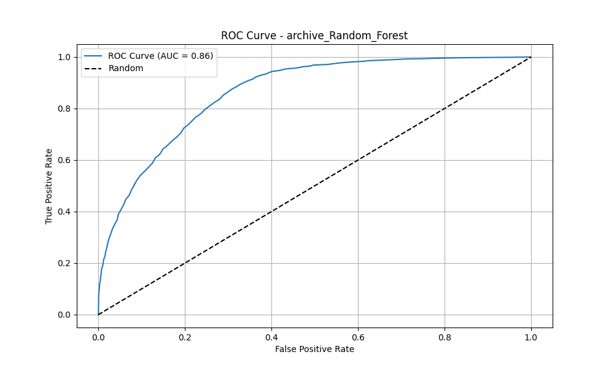

# SmokingML: Advanced Smoking Behavior Prediction Using Machine Learning

## Project Overview
An advanced machine learning system that predicts smoking behavior using health indicators and demographic data. The project implements multiple sophisticated ML models with extensive feature engineering and optimization techniques.





## 🌟 Key Features
- **Advanced Feature Engineering**
  - BMI calculation and health risk indicators
  - Cardiovascular risk assessment
  - Liver function analysis
  - Metabolic indices
  - Polynomial feature interactions
  - Ratio-based features (HDL/LDL, AST/ALT, etc.)

- **Multiple Model Implementation**
  - XGBoost Classifier
  - Random Forest Classifier
  - Ensemble Voting Classifier
  - SMOTE for imbalanced data handling

- **Comprehensive Model Optimization**
  - Hyperparameter tuning using RandomizedSearchCV
  - Custom scoring metrics
  - Cross-validation
  - Feature selection with importance analysis

- **Robust Evaluation Framework**
  - Accuracy, Precision, Recall, F1-score
  - ROC-AUC analysis
  - Confusion matrices
  - Feature importance visualization
  - Detailed error analysis

## 📊 Performance Metrics
### ML Olympiad Dataset
- Accuracy: 0.777
- Precision: 0.720
- Recall: 0.798
- F1-Score: 0.757
- ROC-AUC: 0.860

### Archive Dataset
- Accuracy: 0.772
- Precision: 0.696
- Recall: 0.677
- F1-Score: 0.686
- ROC-AUC: 0.863

## 🛠️ Technical Stack
- **Programming Language**: Python
- **Key Libraries**:
  - scikit-learn
  - XGBoost
  - pandas
  - numpy
  - imbalanced-learn
  - matplotlib/seaborn

## 📂 Project Structure
```
SmokingML V2/
├── artifacts/            # Model artifacts and results
├── config/              # Configuration files
├── data/                # Dataset directory
│   ├── processed/       # Processed datasets
│   └── raw/            # Raw data files
├── models/              # Trained model files
├── notebooks/          # Jupyter notebooks
├── src/                # Source code
│   └── components/     # Model components
└── tests/              # Unit tests
```

## 🔍 Key Components
1. **Data Preprocessing**
   - Feature scaling and normalization
   - Missing value handling
   - Advanced feature engineering
   - Dataset splitting and validation

2. **Model Development**
   - Multiple model architectures
   - Ensemble methods
   - Custom scoring functions
   - Advanced hyperparameter optimization

3. **Evaluation Framework**
   - Comprehensive metrics calculation
   - Visualization generation
   - Error analysis
   - Feature importance analysis

## 📈 Improvements and Optimizations
- Implementation of advanced feature interactions
- Custom ensemble methods for improved prediction
- Sophisticated handling of imbalanced data
- Enhanced model selection and validation process

## 🔧 Installation and Usage
1. Clone the repository
2. Create and activate virtual environment:
   ```bash
   python -m venv SmokeML_v2_venv
   source SmokeML_v2_venv/bin/activate  # Linux/Mac
   # or
   SmokeML_v2_venv\Scripts\activate  # Windows
   ```
3. Install dependencies:
   ```bash
   pip install -e .
   ```
4. Run the training pipeline:
   ```bash
   python src/components/model_training.py
   ```

## 📚 Model Details
- **Feature Set**: 23 health indicators including:
  - Demographic data
  - Physical measurements
  - Blood test results
  - Health indicators
  - Derived features

- **Model Architecture**:
  - Ensemble of XGBoost and Random Forest
  - Custom feature selection
  - Optimized hyperparameters
  - Balanced class handling

## 🎯 Future Improvements
- Integration of deep learning models
- Real-time prediction API
- Additional feature engineering
- Extended model interpretability
- Cross-population validation

## 📝 License
This project is licensed under the MIT License - see the LICENSE file for details.

---
*Note: This project demonstrates advanced machine learning techniques, feature engineering, and model optimization for healthcare applications.*
